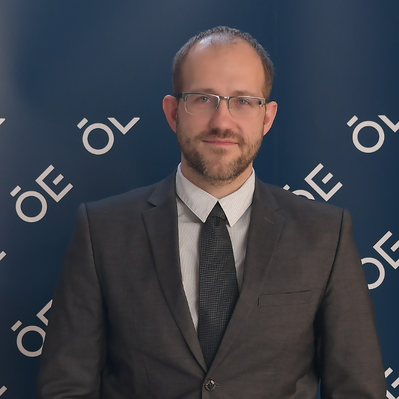

---
# Display name
title: Dr. György Eigner

# Role/position
role: Dean, Óbuda University

# Organizations/Affiliations
organizations:
  - name: Óbuda University
    url: 

# Short bio (displayed in user profile at end of posts)
bio: Dr. György Eigner is the Dean of Óbuda University.

interests:
  - Public Speaking

# Social Networking
# Need to use another icon? Simply download the SVG icon to your `assets/media/icons/` folder.
profiles:
  - icon: brands/linkedin
    url: 'https://www.linkedin.com/in/gy%C3%B6rgy-eigner-906b0178'

# Organizational groups that you belong to (for People widget)
#   Set this to `[]` or comment out if you are not using People widget.
user_groups:
  - Speakers
  - Hosts
  - Committee
---

